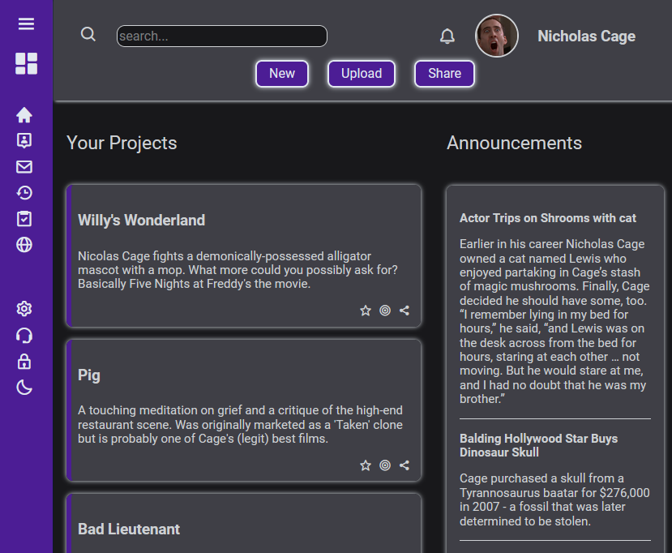

# Admin Dashboard

An admin form built with JS, HTML & CSS as part of The Odin Project curriculum. Designed to be responsive on desktop, tablet and mobile. Makes use of CS grid and has a JS collapsible menu & dark mode built in. 

[Demo here](https://casssb.github.io/admin-dashboard/)

## Thoughts
This project really helped me in getting used to grid and flex. I think I ended up making pretty much everything either a flex or grid container/element. 

## Possible Improvements
* I ended up trying to somewhat follow the example design screenshot but did spend a fair bit of time looking around the web at other types of admin-form layout. I feel like there's a ton of design improvements I could make so that it is more visually appealing. The colours and contrast could do with some improvement also.
* I did a bunch of reading on the ways dark mode can be implemented and I may go back at some point and add in the JS logic to pick up the users preference via local storage or the Window watchMedia method. This could be used to start with the preferred default (mine just starts with light mode). I also looked into adding a slider button or something that makes the selection more visible to the user.
* The way that I implemented the menu takes advantage of grid auto-adjusting (the button removes some text and the column is set to auto-adjust to content width). This works for the style I was going for but I did trial completely removing the nav when the hamburger icon is clicked which does free up more space on mobile. I may go back and implement this at some point.

## Credits
* Icons taken from [Boxicons](https://boxicons.com/)
* Design template from [The Odin Project](https://cdn.statically.io/gh/TheOdinProject/curriculum/main/html_css/grid-lessons/project-dashboard/dashboard-project.png/)
